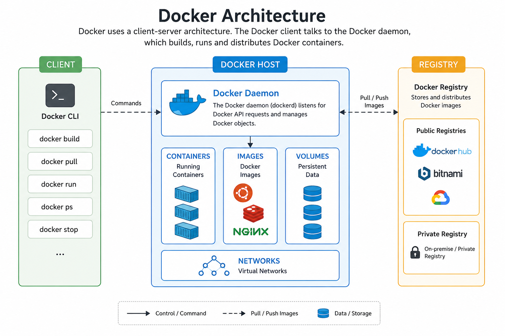
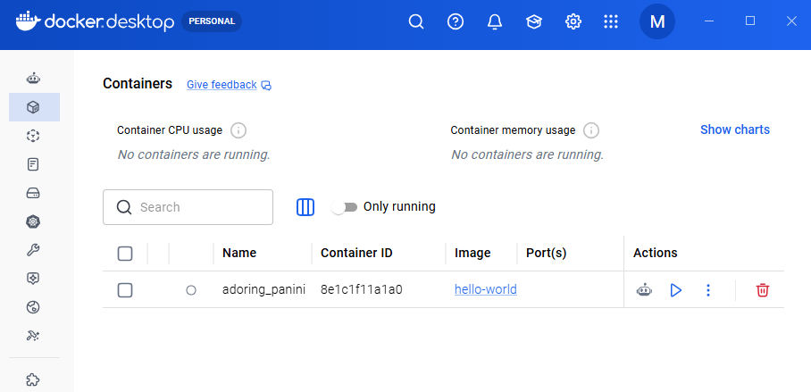

## Challenge Tasks

### Task 1: What is Docker?
Container: 
 - It is lightweight, isolated environment which includes package of libraries and softwares (code, libraries, runtime, configurations, dependencies) that have everything to run an app by virtualizing Host OS kernel.
 - Why containers ?
   - To share package app environment so that it can run anywhere on any machine --> (Portability)
   - Can run different applications in same HOST without any conflict --> (Isolation)
   - Can start/stop containers/applications in seconds --> (Faster & Efficient)

 - Virtual Machines vs Containers ?
    
    | VM | Containers |
    | --- | --- |
    | Virtualize HOST Hardware | Virtualize HOST OS Kernel |
    | High Boot Time (in-mins)| Faster boot time (in-seconds) |
    | Heavy Size (in GB) | Low Size (in MB) |

Docker (Containerization tool):
 - Docker is a containerization tool which will provide a way to run and store containers images (Docker Hub) on any HOST machine.
 - Docker Architecture:-
   - Docker CLI (where we run commands to start/stop/build containers)
   - REST API
   - Docker Daemon (manages object like images, containers, networks, and volumes) --> dockerd
   - Docker Registry (place to store packaged containerized applications)

         Docker CLI --> REST API --> Docker Daemon (dockerd) --> Docker Registry
     
        

---

### Task 2: Install Docker        
 - Install Docker Desktop or Docker CLI
 - Docker Desktop
     
           
 - Run command- docker run hello-world (To check if installation completes correctly) 
    ```text
    PS C:\Users\mukul> docker run hello-world

    Hello from Docker!
    This message shows that your installation appears to be working correctly.

    To generate this message, Docker took the following steps:
    The Docker client contacted the Docker daemon.
    The Docker daemon pulled the "hello-world" image from the Docker Hub.
    (amd64)
    The Docker daemon created a new container from that image which runs the
    executable that produces the output you are currently reading.
    The Docker daemon streamed that output to the Docker client, which sent it
    to your terminal.

    To try something more ambitious, you can run an Ubuntu container with:
    $ docker run -it ubuntu bash

    Share images, automate workflows, and more with a free Docker ID:
    https://hub.docker.com/

    For more examples and ideas, visit:
    https://docs.docker.com/get-started/      
    ```
---

### Task 3: Run Real Containers

- Run an **Nginx** container and access it in your browser
  - docker run -p 8080:80 nginx
    <br>(To run single ubuntu container having nginx installed and running)
    ```text
    PS C:\Users\mukul> docker run -p 8080:80 nginx
    Unable to find image 'nginx:latest' locally
    latest: Pulling from library/nginx
    d84ae7b21412: Pull complete
    5a4222b844e8: Pull complete
    c0df8d325117: Pull complete
    b8b80b9bc028: Pull complete
    f5de6e85ac74: Pull complete
    26c307b5e35a: Pull complete
    3c55dc422a81: Pull complete
    0f03cb4db0ef: Download complete
    92fcf0fc2ef2: Download complete
    ```
  - Browse http://localhost:8080 in any browser.
  - You can see nginx running with default html page of its own.

- Run an **Ubuntu** container in interactive mode — explore it like a mini Linux machine
  - docker run -d ubuntu 
    <br>(To Run single ubuntu container)
  - docker ps 
    <br>(To list all running containers)
     ```text 
     PS C:\Users\mukul> docker ps
     CONTAINER ID   IMAGE     COMMAND                  CREATED              STATUS              PORTS                          
           NAMES
     af7272fcc7af   ubuntu    "bash"                   About a minute ago   Up About a minute                                  
           optimistic_nobel
     f43e9bfd6984   nginx     "/docker-entrypoint.…"   4 minutes ago        Up 4 minutes        0.0.0.0:8080->80/tcp, [::]:8080->80/tcp   hopeful_zhukovsky
     ```
  - docker exec -it af7272fcc7af bash 
    <br>(Use container id to go to container shell)
     ```text
     PS C:\Users\mukul> docker exec -it af7272fcc7af bash
     root@af7272fcc7af:/# ls
     bin  boot  dev  etc  home  lib  lib64  media  mnt  opt  proc  root  run  sbin  srv  sys  tmp  usr  var
     root@af7272fcc7af:/# pwd
     /
     root@af7272fcc7af:/#
     ```

- List all container (Running & Stopped)
  - docker ps 
    <br>(To list all running containers)
  - docker ps -a
    <br>(To list all running containers including stopped ones)
    ```text
    PS C:\Users\mukul> docker ps
    CONTAINER ID   IMAGE     COMMAND                  CREATED          STATUS          PORTS                                  
    NAMES
    e21ac1a425a4   ubuntu    "bash"                   14 minutes ago   Up 14 minutes                                          
    epic_ishizaka
    af7272fcc7af   ubuntu    "bash"                   19 minutes ago   Up 19 minutes                                          
    optimistic_nobel
    f43e9bfd6984   nginx     "/docker-entrypoint.…"   22 minutes ago   Up 22 minutes   0.0.0.0:8080->80/tcp, [::]:8080->80/tcp   hopeful_zhukovsky

    PS C:\Users\mukul> docker ps -a
    CONTAINER ID   IMAGE         COMMAND                  CREATED          STATUS                        PORTS                
                     NAMES
    e21ac1a425a4   ubuntu        "bash"                   14 minutes ago   Up 14 minutes                                      
                     epic_ishizaka
    af7272fcc7af   ubuntu        "bash"                   19 minutes ago   Up 19 minutes                                      
                     optimistic_nobel
    c26e6fe71e22   ubuntu        "bash"                   20 minutes ago   Exited (0) 19 minutes ago                          
                     zen_cray
    6a0efd4e527d   ubuntu        "/bin/bash"              21 minutes ago   Exited (0) 21 minutes ago                          
                     funny_torvalds
    f43e9bfd6984   nginx         "/docker-entrypoint.…"   22 minutes ago   Up 22 minutes                 0.0.0.0:8080->80/tcp, [::]:8080->80/tcp   hopeful_zhukovsky
    91153495f8b9   nginx         "/docker-entrypoint.…"   22 minutes ago   Exited (127) 22 minutes ago                        
                     intelligent_robinson
    664f02cb500e   nginx         "/docker-entrypoint.…"   27 minutes ago   Exited (0) 23 minutes ago                          
                     tender_hodgkin
    2976f7bd2a54   hello-world   "/hello"                 38 minutes ago   Exited (0) 38 minutes ago                          
                     strange_dijkstra
    8e1c1f11a1a0   hello-world   "/hello"                 9 hours ago      Exited (0) 9 hours ago                             
                     adoring_panini
    PS C:\Users\mukul>   

- Stop and Remove a Container
  - Before removing a container, you have to stop it.
  - docker stop `container-id`
    - docker stop e21ac1a425a4
    - docker stop af7272fcc7af
    - docker stop f43e9bfd6984
    
    ```text
    PS C:\Users\mukul> docker stop e21ac1a425a4
    e21ac1a425a4
    PS C:\Users\mukul> docker stop af7272fcc7af
    af7272fcc7af
    PS C:\Users\mukul> docker stop f43e9bfd6984
    f43e9bfd6984
    PS C:\Users\mukul> 
    ```
  - Removing a container.
  - docker rm `container-id`
     - docker rm e21ac1a425a4
     - docker rm af7272fcc7af
     - docker rm f43e9bfd6984
    ```text
    PS C:\Users\mukul> docker stop e21ac1a425a4
    e21ac1a425a4
    PS C:\Users\mukul> docker stop af7272fcc7af
    af7272fcc7af
    PS C:\Users\mukul> docker stop f43e9bfd6984
    f43e9bfd6984
    PS C:\Users\mukul> 
    ```
---

### Task 4: Explore
- Run a container in **detached mode** — what's different?
  - detached mode- `'-d' flag`    
  - In detached mode, container will run in background while you can launch another ones.
  - Example:
     - docker run -d nginx
     - docker run -d ubuntu

- Give a container a custom **name** 
  - Custom name- `--name <container-name>`
  - When creating container:
    - docker run -d --name my-app -p 8081:80 nginx
      <br>(my-app is container name)
  - When container is running:
    - docker rename `<current-name-or-id> <new-name>`  
    - docker rename fd9eac0e7c73 my-nginx
      <br>(my-nginx is custom name for container id fd9eac0e7c73)
      ```text
      PS C:\Users\mukul> docker rename fd9eac0e7c73 my-nginx
      PS C:\Users\mukul> docker ps
      CONTAINER ID   IMAGE     COMMAND                  CREATED          STATUS          PORTS                                  
      NAMES
      fd9eac0e7c73   nginx     "/docker-entrypoint.…"   23 minutes ago   Up 23 minutes   0.0.0.0:8081->80/tcp, [::]:8081->80/tcp   my-nginx
      PS C:\Users\mukul> 
      ```

- Map a **port** from the container to your host
  - Port Mapping: `-p host:container-port`
  - Host mapping is used to export internal running containers port and map them to any HOST port.
  - Example:
     - docker run -d -p 8081:80 nginx
       <br>(This will make container run in background and map container 80port to host 8081 port, and nginx can be accessible on http://localhost:8081/)
       ```text
       PS C:\Users\mukul> docker run -d -p 8081:80 nginx
       fd9eac0e7c73a3fe33910aeeba8807ce9859b867655ede3c7588f77ce5a190f0
       PS C:\Users\mukul> docker ps
       CONTAINER ID   IMAGE     COMMAND                  CREATED              STATUS              PORTS                          
           NAMES
       fd9eac0e7c73   nginx     "/docker-entrypoint.…"   About a minute ago   Up About a minute   0.0.0.0:8081->80/tcp, [::]:8081->80/tcp   tender_dhawan
       PS C:\Users\mukul> 
       ```

- Check **logs** of a running container
  - docker logs `container-id`
  - docker logs fd9eac0e7c73
    ```text
    PS C:\Users\mukul> docker logs fd9eac0e7c73
    /docker-entrypoint.sh: /docker-entrypoint.d/ is not empty, will attempt to perform configuration
    /docker-entrypoint.sh: Looking for shell scripts in /docker-entrypoint.d/
    /docker-entrypoint.sh: Launching /docker-entrypoint.d/10-listen-on-ipv6-by-default.sh
    10-listen-on-ipv6-by-default.sh: info: Getting the checksum of /etc/nginx/conf.d/default.conf
    10-listen-on-ipv6-by-default.sh: info: Enabled listen on IPv6 in /etc/nginx/conf.d/default.conf
    /docker-entrypoint.sh: Sourcing /docker-entrypoint.d/15-local-resolvers.envsh
    /docker-entrypoint.sh: Launching /docker-entrypoint.d/20-envsubst-on-templates.sh
    /docker-entrypoint.sh: Launching /docker-entrypoint.d/30-tune-worker-processes.sh
    /docker-entrypoint.sh: Configuration complete; ready for start up
    2026/08/17 23:50:40 [notice] 1#1: using the "epoll" event method
    2026/08/17 23:50:40 [notice] 1#1: nginx/1.31.3
    2026/08/17 23:50:40 [notice] 1#1: built by gcc 14.2.0 (Debian 14.2.0-19)
    2026/08/17 23:50:40 [notice] 1#1: OS: Linux 6.18.33.2-microsoft-standard-WSL2
    2026/08/17 23:50:40 [notice] 1#1: getrlimit(RLIMIT_NOFILE): 1048576:1048576
    2026/08/17 23:50:40 [notice] 1#1: start worker processes
    2026/08/17 23:50:40 [notice] 1#1: start worker process 29
    2026/08/17 23:50:40 [notice] 1#1: start worker process 30
    2026/08/17 23:50:40 [notice] 1#1: start worker process 31
    2026/08/17 23:50:40 [notice] 1#1: start worker process 32
    ```


- Run a command **inside** a running container
  - docker exec `container-name/id` `command` 
  <br> (To pass single line command)
  - docker exec -it `container-name/id` `shell-name`
  <br> (To run multiple commands inside containers)
  <br> (shell name can be- bash or sh)
  - docker exec my-nginx pwd

   ```text
   PS C:\Users\mukul> docker exec my-nginx pwd 
   /
   PS C:\Users\mukul> docker exec my-nginx ls -la /etc/nginx
   total 48
   drwxr-xr-x 1 root root 4096 Aug  5 00:21 .
   drwxr-xr-x 1 root root 4096 Aug 17 23:50 ..
   drwxr-xr-x 1 root root 4096 Aug 17 23:50 conf.d
   -rw-r--r-- 1 root root 1007 Jul 15 16:03 fastcgi_params
   -rw-r--r-- 1 root root 5349 Jul 15 16:03 mime.types
   lrwxrwxrwx 1 root root   22 Jul 15 16:25 modules -> /usr/lib/nginx/modules
   -rw-r--r-- 1 root root  644 Jul 15 16:25 nginx.conf
   -rw-r--r-- 1 root root  636 Jul 15 16:03 scgi_params
   -rw-r--r-- 1 root root  664 Jul 15 16:03 uwsgi_params
   PS C:\Users\mukul> 
   ```