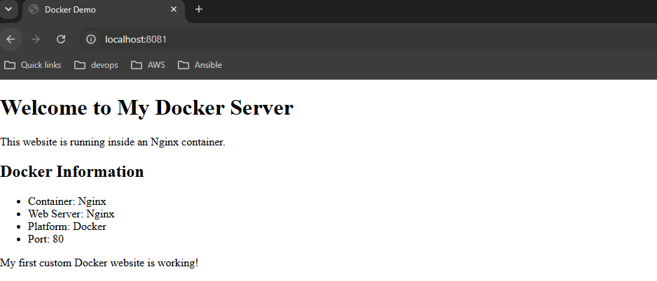

## Challenge Tasks

### Task 1: Your First Dockerfile

- Create a folder called `my-first-image
- Inside it, create a `Dockerfile` that:
   - Uses `ubuntu` as the base image
   - Installs `curl`
   - Sets a default command to print `"Hello from my custom image!"`
- Build the image and tag it `my-ubuntu:v1`
- Run a container from your image

```text
PS C:\Users\mukul> docker build -t my-ubuntu:v1 .
[+] Building 32.8s (6/6) FINISHED                                                                    docker:desktop-linux
 => [internal] load build definition from Dockerfile                                                                 0.1s
 => => transferring dockerfile: 140B                                                                                 0.0s 
 => [internal] load metadata for docker.io/library/ubuntu:latest                                                     0.1s 
 => [internal] load .dockerignore                                                                                    0.1s
 => => transferring context: 2B                                                                                      0.0s 
 => [1/2] FROM docker.io/library/ubuntu:latest@sha256:678c6550cc43645e08669028bc177f50be4e7c5b8cca677067b1914d4afc7  0.1s 
 => => resolve docker.io/library/ubuntu:latest@sha256:678c6550cc43645e08669028bc177f50be4e7c5b8cca677067b1914d4afc7  0.1s 
 => [2/2] RUN apt update && apt install -y curl                                                                     24.6s
 => exporting to image                                                                                               7.6s
 => => exporting layers                                                                                              4.5s
 => => exporting manifest sha256:61159762c0d570e88fa8fd711a978cb37766464d4af7c40b83d6bb529fc03f58                    0.0s 
 => => exporting config sha256:af64b412b0f55e9ef5bde4abd53098b5433edaf4ead58c441b366a26c664a31e                      0.0s 
 => => exporting attestation manifest sha256:74044db8739f78684e64c07689d67b15001b0fdfe8f1b8207bf724fd4bf5a9c3        0.0s 
 => => exporting manifest list sha256:c3872d4871b4cdd2f020e2ae5d7d87ef4e21516c2e891f61e27d39eee2435c0e               0.0s 
 => => naming to docker.io/library/my-ubuntu:v1                                                                      0.0s 
 => => unpacking to docker.io/library/my-ubuntu:v1                                                                   2.9s 

View build details: docker-desktop://dashboard/build/desktop-linux/desktop-linux/l8rqzj2mp6n30mlm6vfc61oi1
PS C:\Users\mukul> docker images
IMAGE           ID             DISK USAGE   CONTENT SIZE   EXTRA
alpine:latest   28bd5fe8b56d         13MB         3.93MB
my-ubuntu:v1    c3872d4871b4        257MB         78.4MB
mysql:latest    66aec17cd21a        1.3GB          290MB
nginx:latest    8541484afbc9        241MB           66MB
ubuntu:latest   678c6550cc43        160MB         45.3MB
PS C:\Users\mukul> docker run --name my-app my-ubuntu:v1
Hello from my custom image
PS C:\Users\mukul> 
```
---

### Task 2: Dockerfile Instructions
Create a new Dockerfile that uses **all** of these instructions:
- `FROM` — base image
- `RUN` — execute commands during build
- `COPY` — copy files from host to image
- `WORKDIR` — set working directory
- `EXPOSE` — document the port
- `CMD` — default command

<br>`Dockerfile`
```text
FROM ubuntu
RUN apt update && apt install nginx -y
WORKDIR /app
COPY index.html /usr/share/nginx/html/index.html
EXPOSE 80
CMD ["nginx", "-g", "daemon off;"]
```
```text
PS C:\Users\mukul\first-image> docker build -t mynginx:v2 .
[+] Building 1.4s (9/9) FINISHED                                                                     docker:desktop-linux
 => [internal] load build definition from Dockerfile                                                                 0.1s
 => => transferring dockerfile: 197B                                                                                 0.0s 
 => [internal] load metadata for docker.io/library/ubuntu:latest                                                     0.1s 
 => [internal] load .dockerignore                                                                                    0.0s
 => => transferring context: 2B                                                                                      0.0s 
 => [1/4] FROM docker.io/library/ubuntu:latest@sha256:678c6550cc43645e08669028bc177f50be4e7c5b8cca677067b1914d4afc7  0.1s 
 => => resolve docker.io/library/ubuntu:latest@sha256:678c6550cc43645e08669028bc177f50be4e7c5b8cca677067b1914d4afc7  0.0s 
 => [internal] load build context                                                                                    0.0s 
 => => transferring context: 32B                                                                                     0.0s 
 => CACHED [2/4] RUN apt update && apt install nginx -y                                                              0.0s
 => CACHED [3/4] WORKDIR /app                                                                                        0.0s 
 => [4/4] COPY index.html /var/www/html/index.html                                                                   0.1s 
 => exporting to image                                                                                               0.7s 
 => => exporting layers                                                                                              0.1s 
 => => exporting manifest sha256:54e601c2c5b5dbbeb9547d0afd2d72eda8d1567c9f379702359ed0a9920811c8                    0.0s 
 => => exporting config sha256:dc9536c0810a08b9b4b2861fc4f3abb5122c688959c6b0da75a4a3fe8ebd663e                      0.0s 
 => => exporting attestation manifest sha256:3889b152237074880ada396d7d32f3951b72d478857ee80202c9087d5c20772c        0.1s 
 => => exporting manifest list sha256:97a2d1fe320a0ddf6ae07bf3c05a6d1b1318e2dd77074e77c957f65f950b6a3a               0.1s 
 => => naming to docker.io/library/mynginx:v2                                                                        0.0s 
 => => unpacking to docker.io/library/mynginx:v2                                                                     0.1s 
```
```text
PS C:\Users\mukul\first-image> docker run -d -p 8081:80 --name my-nginx2 mynginx:v2
2c8d4d22a061cccdb7e3b4de5185ac1312179d7b3b37372b89ee0a0ce0e36373
PS C:\Users\mukul\first-image> 
```


---
### Task 3: CMD vs ENTRYPOINT
- Create an image with `CMD ["echo", "hello"]` — run it, then run it with a custom command. What happens?
  - Dockerfile
    ```text
    FROM ubuntu
    CMD ["echo","Hello"]
    ```
  - Run below in same directory where dockerfile is.
    `docker build -t cmd .`
  - Run below command to run container with this image.
    `docker run cmd`
  - In Output, a Hello will output always.
  - CMD will run at startup always.

- Create an image with `ENTRYPOINT ["echo"]` — run it, then run it with additional arguments. What happens?
  - Dockerfile
    ```text
    FROM ubuntu
    ENTYPOINT ["echo"]
    ```
  - Run below in same directory where dockerfile is.
    `docker build -t entry`
  - Run below command to run container with this image.
    `docker run entry "Hlo from Custom Docker"
  - In Output, a "Hlo from Custom Docker" will appear based on arguments.
  - When passing custom arguments, arguments replace CMD content and merge it with ENTYPOINT if mentioned.

- Write in your notes: When would you use CMD vs ENTRYPOINT?
   - CMD


   - ENTRYPOINT


---
### Task 4: Build a Simple Web App Image
1. Create a small static HTML file (`index.html`) with any content
2. Write a Dockerfile that:
   - Uses `nginx:alpine` as base
   - Copies your `index.html` to the Nginx web directory
3. Build and tag it `my-website:v1`
4. Run it with port mapping and access it in your browser

---

### Task 5: .dockerignore
1. Create a `.dockerignore` file in one of your project folders
2. Add entries for: `node_modules`, `.git`, `*.md`, `.env`
3. Build the image — verify that ignored files are not include


---

### Task 6: Build Optimization
1. Build an image, then change one line and rebuild — notice how Docker uses **cache**
2. Reorder your Dockerfile so that frequently changing lines come **last**
3. Write in your notes: Why does layer order matter for build speed?